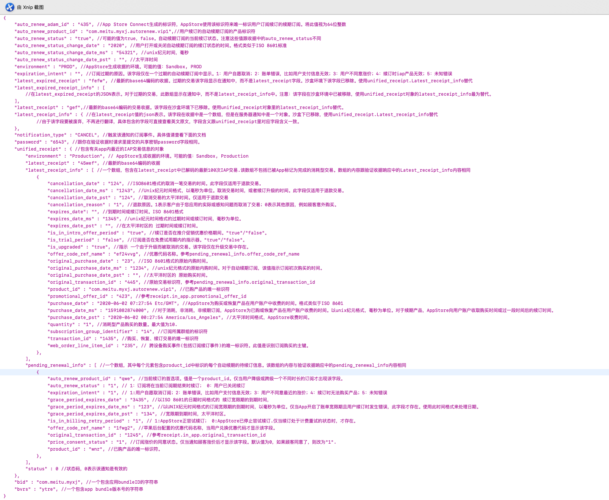

# IAP 服务器通知的解释

原文请查看[App Store服务器通知](https://developer.apple.com/documentation/appstoreservernotifications/responsebody)

将服务器通知的格式，以及字段含义解释如下：

```
{
    "auto_renew_adam_id" : "435", //App Store Connect生成的标识符，AppStore使用该标识符来唯一标识用户订阅续订的续期订阅。将此值视为64位整数
    "auto_renew_product_id" : "com.meitu.myxj.autorenew.vip1",//用户续订的自动续期订阅的产品标识符
	"auto_renew_status" : "true", //可能的值为true，false。自动续期订阅的当前续订状态。注意这些值跟收据中的auto_renew_status不同
	"auto_renew_status_change_date" : "2020", //用户打开或关闭自动续期订阅的续订状态的时间。格式类似于ISO 8601标准
	"auto_renew_status_change_date_ms" : "54321", //unix纪元时间，毫秒
	"auto_renew_status_change_date_pst" : "", //太平洋时间
	"environment" : "PROD", //AppStore生成收据的环境。可能的值：Sandbox, PROD
	"expiration_intent" : "", //订阅过期的原因。该字段仅在一个过期的自动续期订阅中显示。1：用户自愿取消；2：账单错误，比如用户支付信息无效；3：用户不同意涨价；4：续订时iap产品无效；5：未知错误
	"latest_expired_receipt" : "fefw", //最新的base64编码的收据。过期的交易该字段显示在通知中，而不是latest_receipt字段。沙盒环境下该字段已移除。使用unified_receipt.Latest_receipt_info替代
	"latest_expired_receipt_info" : [ 
        //在latest_expired_receipt的JSON表示。对于过期的交易，此数组显示在通知中，而不是latest_receipt_info中。注意：该字段在沙盒环境中已被移除，使用unified_receipt对象的latest_receipt_info最为替代。
	],
	"latest_receipt" : "gef",//最新的base64编码的交易收据。该字段在沙盒环境下已移除。使用unified_receipt对象里的latest_receipt_info替代。
	"latest_receipt_info" : { //在latest_receipt值的json表示。该字段在收据中是一个数组，但是在服务器通知中是一个对象。沙盒下已移除，使用unified_receipt.Latest_receipt_info替代
			//由于该字段要被废弃，不再进行翻译，具体包含的字段可直接查看英文原文，字段含义跟unified_receipt里对应字段含义一致。
	},
	"notification_type" : "CANCEL", //触发该通知的订阅事件。具体值请查看下面的文档
	"password" : "6543", //跟你在验证收据时请求里提交的共享密钥password字段相同。
	"unified_receipt" : { //包含有关app内最近的IAP交易信息的对象 	
        "environment" : "Production", // AppStore生成收据的环境。可能的值：Sandbox, Production
        "latest_receipt" : "45wef", //最新的base64编码的收据
        "latest_receipt_info" : [ //一个数组，包含在latest_receipt中已解码的最新100次IAP交易.该数组不包括已被App标记为完成的消耗型交易。数组的内容跟验证收据响应中的Latest_receipt_info内容相同
            {
                "cancellation_date" : "124", //ISO8601格式的取消一笔交易的时间。此字段仅适用于退款交易。
                "cancellation_date_ms" : "1243", //Unix纪元时间格式，以毫秒为单位。取消交易时间，或者续订升级的时间。此字段仅适用于退款交易。
                "cancellation_date_pst" : "124", //取消交易的太平洋时间。仅适用于退款交易
                "cancellation_reason" : "1", //退款原因。1表示客户由于您应用的实际或感知问题而取消了交易；0表示其他原因，例如顾客意外购买。
                "expires_date": "", //到期时间或续订时间。ISO 8601格式
                "expires_date_ms" : "1345", //unix纪元时间格式的过期时间或续订时间，毫秒为单位。
                "expires_date_pst" : "", //在太平洋时区的 过期时间或续订时间。
                "is_in_intro_offer_period" : "true", //续订是否在推介促销优惠价格期间。"true"/"false"。
                "is_trial_period" : "false", //订阅是否在免费试用期内的指示器。"true"/"false"。
                "is_upgraded" : "true", //指示 一个由于升级而被取消的交易。该字段仅在升级交易中存在。
                "offer_code_ref_name" : "ef24vvg", //优惠代码名称。参考pending_renewal_info.offer_code_ref_name
                "original_purchase_date" : "23", //ISO 8601格式的原始内购时间。
                "original_purchase_date_ms" : "1234", //unix纪元格式的原始内购时间。对于自动续期订阅，该值指示订阅初次购买的时间。
                "original_purchase_date_pst" : "", //太平洋时区的 原始购买时间。
                "original_transaction_id" : "445", //原始交易标识符，参考pending_renewal_info.original_transaction_id
                "product_id" : "com.meitu.myxj.autorenew.vip1", //已购产品的唯一标识符
                "promotional_offer_id" : "423", //参考receipt.in_app.promotional_offer_id
                "purchase_date" : "2020-06-02 07:27:54 Etc/GMT", //AppStore为购买或恢复产品在用户账户中收费的时间。格式类似于ISO 8601
                "purchase_date_ms" : "1591082874000", //对于消耗，非消耗，非续期订阅，AppStore为已购或恢复产品在用户账户收费的时间。以unix纪元格式，毫秒为单位。对于续期产品，AppStore向用户账户收取购买时间或过一段时间后的续订时间。
                "purchase_date_pst" : "2020-06-02 00:27:54 America/Los_Angeles", //太平洋时间格式，AppStore收费时间。
                "quantity" : "1", //消耗型产品购买的数量。最大值为10.
                "subscription_group_identifier" : "14", //订阅所属群组的标识符
                "transaction_id" : "1435", //购买、恢复、续订交易的唯一标识符
                "web_order_line_item_id" : "235", // 跨设备购买事件(包括订阅续订事件)的唯一标识符。此值是识别订阅购买的主键。
            },
        ],
		"pending_renewal_info" : [ //一个数组，其中每个元素包含product_id中标识的每个自动续期的待续订信息。该数组的内容与验证收据响应中的pending_renewal_info内容相同
            {
                "auto_renew_product_id" : "qwe", //当前续订的首选项。值是一个product_id。仅当用户降级或跨级一个不同时长的订阅才出现该字段。
                "auto_renew_status" : "1", // 1：订阅将在当前订阅期结束时续订； 0：用户已关闭续订
                "expiration_intent" : "1", // 1:用户自愿取消订阅；2：账单错误，比如用户支付信息无效；3：用户不同意最近的涨价；4：续订时无法购买产品；5：未知错误
                "grace_period_expires_date" : "3435", //以ISO 8601的日期时间格式的 续订宽限期的到期时间，
                "grace_period_expires_date_ms" : "123", //以UNIX纪元时间格式的订阅宽限期的到期时间，以毫秒为单位。仅当App开启了账单宽限期且用户续订时发生错误，此字段才存在。使用此时间格式来处理日期。
                "grace_period_expires_date_pst" : "134", //宽限期到期时间，太平洋时区。
                "is_in_billing_retry_period" : "1", // 1:AppStore正尝试续订； 0:AppStore已停止尝试续订.仅当续订处于计费重试的状态时，才存在。
                "offer_code_ref_name" : "1fwg2", //苹果后台配置的优惠代码名称，当用户兑换优惠代码才显示该字段。 
                "original_transaction_id" : "1245", //参考receipt.in_app.original_transaction_id
                "price_consent_status" : "1", //订阅涨价的同意状态。仅当通知顾客涨价后才显示该字段。默认值为0，如果顾客同意了，则改为"1".
                "product_id" : "wnr", //已购产品的唯一标识符。
            },
		],
		"status" : 0 //状态码，0表示该通知是有效的
	},
	"bid" : "com.meitu.myxj", //一个包含应用bundleID的字符串
	"bvrs" : "ytre", //一个包含app bundle版本号的字符串
} 
```

上述字段中`notification_type`的值，可能有多个，具体值，以及含义请查看[通知类型解释](noti_type_exp.md)

上述字段的json表示，也可查看下图

